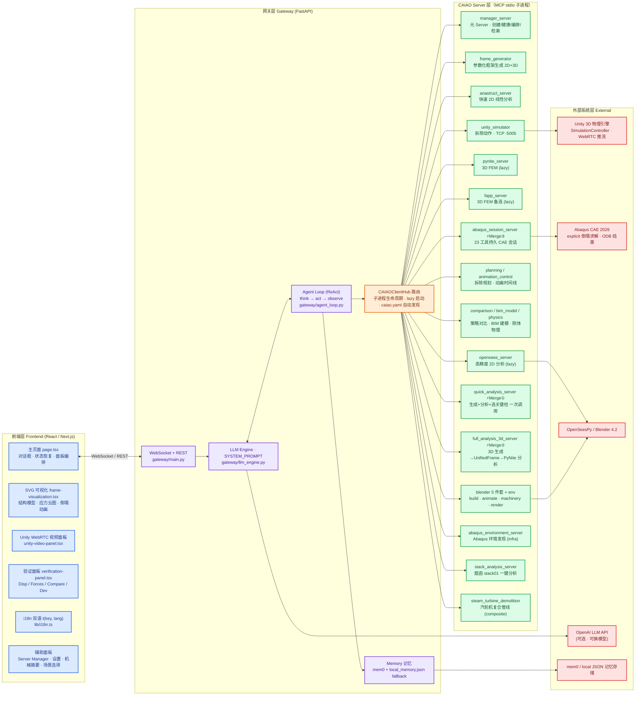
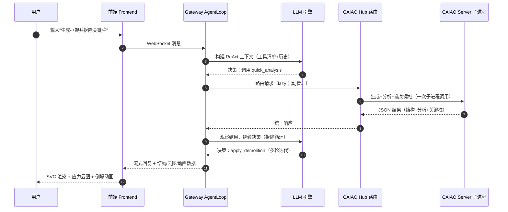

# XuanwuAI Demolition Simulator — 项目路线架构

> 生成日期：2026-08-25 ｜ 本文档是项目的**路线架构全景图**：架构、功能、技术栈、路线图一站式总览。
> 技术细节以 `ARCHITECTURE.md`（CAIAO Bus 原理）与 `CAIAO_PROTOCOL.md`（协议完整参考 + Server Registry）为准，本文档是导航层。

---

## 1. 项目定位与核心价值

**一句话定位：** AI 驱动的渐进式建筑倒塌分析模拟系统 —— 用户输入框架参数，AI 生成结构、分析力学、识别关键柱，多轮渐进拆除直到完全倒塌。

**核心价值点：**

| # | 价值点 | 说明 |
|---|--------|------|
| 1 | **渐进式多轮拆除** | 不是拆一根，而是多轮杆件拆除 + 每次拆除后 AI 自动重新分析，直到结构完全倒塌 —— 项目的核心价值 |
| 2 | **Everything is a CAIAO Server** | 每个求解器/工具都是独立 CAIAO Server 子进程，通过 CAIAO Hub 路由；新增能力 = 写一个 Server 文件 + 注册，零核心代码改动 |
| 3 | **CAIAOServerizer 声明式组合** | CAIAO Server 是最小原子单元（类比 LLM token），高频序列可合并（merge）为复合 Server（类比 BPE）—— 已落地 2 个 merge |
| 4 | **多引擎并存** | anaStruct（快速）/ OpenSees（高精度）/ PyNite / FAPP（3D）/ Abaqus（显式倒塌 FEM）/ Unity（实时物理）/ Blender（渲染） |
| 5 | **双轨可视化** | Unity WebRTC 3D 实时流（主） + SVG requestAnimationFrame 2D 动画（降级），Unity 不在时自动 fallback |
| 6 | **工程级仿真能力** | 冷却塔 / 烟囱 Abaqus 显式倒塌仿真全链路（建模 → 求解 → 提帧 → 渲染合成 → 占地报告） |

---

## 2. 系统架构总览（彩色架构图）



**配色约定：** 蓝 = 前端层 ｜ 紫 = 网关层 ｜ 橙 = CAIAO Hub 路由 ｜ 绿 = CAIAO Server 层 ｜ 红 = 外部系统层。

---

## 3. 分层架构详解

### 3.1 前端层（Frontend）

| 模块 | 文件 | 职责 |
|------|------|------|
| 主页面 | `frontend/app/page.tsx` | 全站 65%+ 逻辑：对话框、状态管理、会话恢复（`restoreStateFromMessages()`）、面板编排 |
| SVG 可视化 | `frontend/components/frame-visualization.tsx` | 结构模型 + 应力比云图 + requestAnimationFrame 倒塌动画；应力比 `FY=235e6`（钢屈服强度），配色 绿<30% / 黄30-60% / 橙60-85% / 红>85% |
| Unity 面板 | `frontend/components/unity-video-panel.tsx` | WebRTC 视频流渲染 3D 视图，一键启动 Unity |
| 验证面板 | `frontend/components/verification-panel.tsx` | 双轨验证（Displacements / Forces / Compare / Dev） |
| 国际化 | `frontend/lib/i18n.ts` | `t(key, lang)` 双语，英文为源语言，未翻译自动 fallback 英文，dev 模式 console.warn 提示 |

### 3.2 网关层（Gateway）

| 模块 | 文件 | 职责 |
|------|------|------|
| 入口 | `gateway/main.py` | API + WebSocket + lifespan 生命周期 |
| LLM 引擎 | `gateway/llm_engine.py` | SYSTEM_PROMPT + OpenAI SDK 封装 |
| Agent Loop | `gateway/agent_loop.py` | ReAct 循环（think → act → observe），TOOL_KEYWORD_MAP 工具路由（含 23 个 abaqus 工具） |
| 记忆 | `gateway/memory.py` | mem0 + 本地 `local_memory.json` 双轨 fallback，无 API key 也能跑 |
| Hub 路由 | `gateway/caiao_config.py` | caiao.yaml 自动发现（替代硬编码 SERVER_CONFIGS），`@abaqus_python@` 哨兵支持 |
| 路由拆分 | `gateway/routers/` | tools / verify / servers / settings / unity 五个 REST 路由模块 + `services/pipeline_service.py` |

### 3.3 CAIAO Server 层（31 台已注册）

| 类别 | Server | 说明 |
|------|--------|------|
| ⚡ Merged（3） | `quick_analysis_server` | Merge① Pipeline A：generate + analyze + select_critical 合并为单次调用 |
| ⚡ Merged（3） | `full_analysis_3d_server` | Merge② Pipeline B：3D 生成 → UnifiedFrame 转换 → PyNite 3D 分析 → 选关键柱 |
| ⚡ Merged（3） | `abaqus_session_server` | Merge③：23 工具持久 Abaqus CAE 会话（建模/分析/拆除/冷却塔/渲染） |
| Atomic 分析 | `anastruct_server` / `opensees_server` / `pynite_server` / `fapp_server` | 四引擎：快速 2D / 高精度 2D / 3D FEM ×2 |
| Atomic 生成 | `frame_generator` / `bim_model_server` / `steel_frame_3d_generator` | 参数化框架、BIM+IFC、3D 钢框架 |
| Atomic 规划 | `planning_server` / `animation_control_server` / `comparison_server` / `physics_server` | 拆除序列、动画时间线、策略对比、刚体物理 |
| Atomic 模拟 | `unity_simulator` | Unity TCP :5005 桥接 |
| Blender 系 | `blender_build/animate/machinery/render/pipeline_server` + `blender_environment_server`(infra) | 程序化建模 → 动画 → 机械 → 渲染 MP4 |
| 基础设施 | `abaqus_environment_server` | Abaqus 路径/许可/环境发现，eager 启动 |
| 元管理 | `manager_server` | 24 工具：创建/扩展/健康/迁移/检索/编排，自我管理（dogfooding） |
| 领域专用 | `stack_analysis_server` | 烟囱 stack01 一键倒塌分析（薄封装） |
| Composite | `steam_turbine_demolition` / `visual_demolition` / `full_bim_demolition` | 网关级声明式管线编排（无子进程） |
| 其他 | `agnes_video_server` / `scenario_server` / `demo_calculator` | 视频生成 / 场景库 / 示例计算器 |

### 3.4 外部系统层

| 系统 | 用途 | 连接方式 |
|------|------|---------|
| Unity 3D | 实时物理倒塌 + WebRTC 推流 | `unity_simulator` TCP :5005 + SDP 信令经 Gateway |
| Abaqus CAE | 冷却塔/烟囱显式倒塌求解 | `abaqus_session_server` JSON-RPC 桥 + 宿主 INP fallback |
| OpenSeesPy | 高精度 2D 验证 | `opensees_server`（Windows 用 WSL2） |
| Blender 4.2 | 程序化建模 + 动画渲染 MP4 | Blender 系 5 server |
| OpenAI API | LLM 决策 | 可换模型（`model_capabilities.py`） |

---

## 4. 核心功能特色清单

| 功能 | 说明 | 状态 |
|------|------|------|
| **渐进式多轮拆除** | 多轮杆件拆除 + 每次拆除后 AI 自动重新分析，直到结构完全倒塌 | ✅ 已完成 |
| **应力比云图** | 按应力比着色：绿<30% / 黄30-60% / 橙60-85% / 红>85%，Deformation / Stress Ratio 视图切换 | ✅ 已完成 |
| **SVG 倒塌动画** | requestAnimationFrame 物理动画，非 ASCII 占位符 | ✅ 已完成 |
| **OpenSees 高精度验证** | verify endpoint 对比验证，structure 参数传递已修复 | ✅ 已完成 |
| **对话完整状态恢复** | 切换/重载后恢复结构+分析+倒塌动画+应力云图 | ✅ 已完成 |
| **Unity WebRTC 3D 实时倒塌** | 一键 Launch + 自动搭建场景 + 自动 Play，SDP 信令经 Gateway | ✅ 已完成 |
| **CAIAOServerizer 组合** | 2 个 merge 落地（Pipeline A/B）；Merge③ Abaqus 会话化 | ✅ 已完成（3 个） |
| **双语 i18n** | 英文源语言 + 中文按需补齐，`t(key, lang)` 全链路 | ✅ 已完成 |
| **本地记忆 fallback** | mem0 不可用自动落 local_memory.json | ✅ 已完成 |
| **可读日志** | 提取关键指标人类可读显示，不 dump 原始 JSON | ✅ 已完成 |
| **设置面板存储管理** | 清空对话 / 清空记忆 / 导出备份 | ✅ 已完成 |
| **冷却塔 Abaqus 仿真** | 塔几何/壁厚/洞口/网格参数化，显式倒塌 + CDP 材料 + 钢筋层 | ✅ 已完成（run 8+ 基准） |
| **烟囱 stack01 分析** | 一键参数化倒塌分析，PASS/FAIL 验收 | ✅ 已完成（run 39 基准） |
| **实拍视频校准** | 现场 6s 四阶段时间线对标（0-2s 慢倾 → 2s 加速 → 4s 根部断裂 → 扑倒） | 🔄 进行中 |
| **并行资源自适应** | 多 Server 并行前评估负载，超限自动回退串行 | 🔄 进行中（P0） |

---

## 5. 数据流与典型场景

### 5.1 主链路时序图



### 5.2 冷却塔 Abaqus 仿真链路（宿主脚本）

```
建模验证(8/8 ALL_PASS) → 求解(.sta + collapse_happened) → 提帧(ODB→data.npz 50帧)
→ 渲染合成(MP4 部署 frontend) → 占地报告(footprint JSON 核对)
```

- 每轮独立文件夹 + ODB 留底，严禁覆盖旧轮（run 13 教训）
- 长任务（>5 分钟）一律用 `run_with_wake.py` 包裹，防电源计划睡眠中断
- 前端 LLM 已可驱动 4 个冷却塔工具（create_cooling_tower / assign_tower_materials / mesh_tower / setup_tower_collapse），P0 端到端验证待执行

---

## 6. 技术栈

| 层 | 技术 | 说明 |
|----|------|------|
| 前端 | React / Next.js / TypeScript | 单页应用，65% 逻辑在 page.tsx |
| 可视化 | SVG + requestAnimationFrame | 2D 降级方案（不用 Three.js） |
| 3D 可视化 | Unity 3D + WebRTC | SimulationController.cs TCP :5005 物理拆除 |
| 网关 | FastAPI + WebSocket | 异步消息 + REST 拆分路由 |
| 智能 | OpenAI SDK + ReAct AgentLoop | SYSTEM_PROMPT 驱动工具决策 |
| 记忆 | mem0 / local_memory.json | 双轨 fallback |
| 分析引擎 | anaStruct / OpenSeesPy / PyNite / FAPP | 2D 快速 / 2D 高精度 / 3D FEM ×2 |
| 显式求解 | Abaqus CAE 2026 | 冷却塔/烟囱倒塌，CDP 混凝土 + 钢筋层 |
| 3D 渲染 | Blender 4.2 | 程序化建模 + 动画 + MP4 合成 |
| 服务框架 | MCP SDK（Python `mcp` 包） | stdio + JSON-RPC，项目内命名为 CAIAO |

---

## 7. 路线图

### ✅ 已完成

| 项目 | 说明 |
|------|------|
| 框架生成 + 快速分析 | anaStruct 2D 线性分析全链路 |
| 关键柱识别 | 轴力最大柱 |
| 渐进式多轮拆除 | AI 自动重新分析循环 |
| 应力比云图 | 四档颜色可视化 |
| SVG 倒塌动画 | requestAnimationFrame |
| OpenSees 高精度验证 | structure 参数已修复 |
| 对话完整状态恢复 | restoreStateFromMessages() |
| Unity 3D 集成 | WebRTC + 一键启动 + 自动场景 + 自动 Play |
| CAIAOServerizer Merge①② | quick_analysis + full_analysis_3d |
| Abaqus 冷却塔仿真 | 4 工具 + 23 工具会话 + 异步求解管线 |
| 烟囱 stack01 | stack_analysis_server + run39 基准 |
| 双轨验证面板 | Disp / Forces / Compare / Dev |

### 🔄 进行中

| 优先级 | 项目 | 说明 |
|--------|------|------|
| **P0** | 并行资源自适应评估 | 多 Server 并行前 CPU>80% / 内存<2GB 则回退串行 —— 核心机制，现在就要实现 |
| **P0** | 冷却塔仿真端到端验证 | 前端 LLM 驱动 4 工具全链路（当前主要走宿主脚本） |
| **P0** | 烟囱 stack01 CAIAO 薄封装 | 工具链完整，缺前端 LLM 驱动验证 |
| **P0** | 实拍视频校准 | 四阶段时间线对标 run 13+，占地/开裂/开洞角对照 |
| P1 | Unity 与 SVG 双轨一致性 | 两套渲染结果对齐 |
| P1 | 渲染/提帧脚本自动化 | ODB_PATH 硬编码改为参数化 |
| P2 | 2026 内核 assembly.Set 修复 | 主路径已绕行（宿主 INP fallback） |

### 📋 规划中

| 优先级 | 项目 | 说明 |
|--------|------|------|
| P1 | 向量语义路由 | embedding 匹配请求到 Server/组合，替代硬编码路由 |
| P1 | 自进化组合固化 | 记录高频组合 → 自动固化 → 优化编排顺序 |
| P1 | Verify Suite Merge（Roadmap #3） | anastruct + opensees + pynite + fapp → consensus |
| P1 | Demolition Cycle Merge（Roadmap #4） | apply_demolition + analyze + select_critical |
| P2 | 多 Server 并行编排 | 依赖图驱动的并行执行调度 |
| P2 | WebRTC 优化 | 延迟/码率自适应，弱网降级 |
| P2 | Blender Daemon 架构 | 单持久 Blender 进程消除冷启动（设计已定） |

---

## 8. 目录结构

```
Demolition-Simulator/
├── gateway/                    # FastAPI 后端（LLM + Agent Loop + Hub）
│   ├── main.py                 # API + WebSocket + lifespan
│   ├── llm_engine.py           # SYSTEM_PROMPT + OpenAI SDK
│   ├── agent_loop.py           # ReAct 循环 + TOOL_KEYWORD_MAP
│   ├── memory.py               # mem0 + local JSON fallback
│   ├── caiao_config.py         # caiao.yaml 自动发现
│   ├── routers/                # tools / verify / servers / settings / unity
│   ├── services/               # pipeline_service / verify_service
│   └── tests/                  # 单元测试
├── caiao_servers/              # CAIAO Server 注册表（31 台）
│   ├── quick_analysis_server/  # ⚡ Merge① 快速分析管线
│   ├── full_analysis_3d_server/# ⚡ Merge② 3D 全分析管线
│   ├── abaqus_session_server/  # ⚡ Merge③ 23 工具持久 CAE 会话
│   ├── manager_server/         # 元 Server（创建/健康/编排/检索）
│   ├── abaqus_environment_server/  # Abaqus 环境发现（infra）
│   ├── blender_*_server/       # Blender 5 件套 + env（infra）
│   ├── anastruct/opensees/pynite/fapp_server/  # 四分析引擎
│   ├── unity_simulator/        # Unity TCP 桥
│   ├── stack_analysis_server/  # 烟囱 stack01 分析
│   └── ...                     # planning/animation/comparison/physics/bim 等
├── unity_project/              # Unity 3D 工程
│   ├── Assets/Scripts/SimulationController.cs  # TCP :5005 物理拆除
│   ├── Assets/Scripts/FrameBuilder.cs          # 程序化建模
│   ├── Assets/Scripts/WebRTCStreamer.cs        # WebRTC 推流
│   └── Assets/Scripts/Editor/XuanwuAISceneSetup.cs  # 一键场景搭建
├── frontend/                   # React 前端
│   ├── app/page.tsx            # 主页面
│   ├── components/             # 26 个组件（可视化/验证/面板/管理）
│   └── lib/i18n.ts             # 中英双语翻译
├── blender_pipeline/           # Blender 管线工程
│   └── projects/               # 汽轮机等专项场景
├── scripts/                    # 宿主/内核侧工具脚本
│   ├── run_tower_collapse.py   # 冷却塔求解驱动
│   ├── stack_quick_analysis.py # 烟囱快速分析
│   ├── render_tower_frames.py  # 渲染合成
│   ├── run_with_wake.py        # 长任务防睡眠包裹
│   └── ...
├── dev-notes/                  # 知识库
│   ├── abaqus/                 # 冷却塔手册/参数文件
│   ├── decisions/              # 技术决策
│   └── architecture/           # 架构文档
├── todo/                       # 冷却塔/烟囱 run 记录
├── docs/instances/             # 实例指南（stack01 等）
├── ARCHITECTURE.md             # CAIAO Bus 技术原理
├── CAIAO_PROTOCOL.md           # CAIAO 协议完整参考
└── PROJECT_ROADMAP.md          # 本文档
```

---

## 9. 相关文档导航

| 文档 | 内容 |
|------|------|
| `ARCHITECTURE.md` | CAIAO Bus 技术原理、Server 契约、Merge 模式详解 |
| `CAIAO_PROTOCOL.md` | 完整参考：Server Registry（31 台）、Merge Roadmap、命名/契约规则、变更日志 |
| `CLAUDE.md` | 项目约束与指令（对话零输出、CAIAO 规则、冷却塔速查） |
| `dev-notes/abaqus/2026-08-22-cooling-tower-*` | 冷却塔手册 + 参数文件（跑法/调优/版本历史） |
| `dev-notes/abaqus/2026-08-23-site-collapse-description.md` | 现场倒塌时间线权威汇总（run 13+ 对标基准） |
